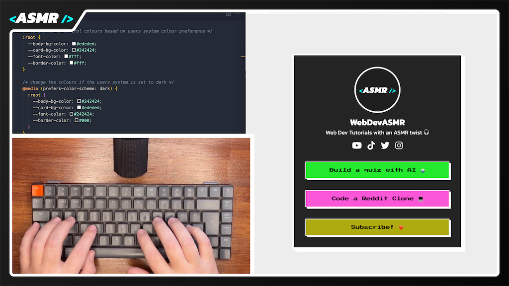

# Retro Links Page | WebDevASMR

Develop a retro-styled linktree page in this ASMR Programming tutorial.
Follow along as we create a unique and eye-catching one-page website for organizing all your important links in a vintage-inspired design.

[Watch the video here:](https://www.youtube.com/watch?v=_zCcJdwT3LE?sub_confirmation=1)
[](https://www.youtube.com/watch?v=_zCcJdwT3LE?sub_confirmation=1)

## Resources

### External CSS

This project uses CSS Reset, Font Awesome and Google Fonts.

```html
<link
  rel="stylesheet"
  href="https://cdnjs.cloudflare.com/ajax/libs/meyer-reset/2.0/reset.min.css"
/>
<link
  rel="stylesheet"
  href="https://cdnjs.cloudflare.com/ajax/libs/font-awesome/6.4.0/css/all.min.css"
/>
<link rel="preconnect" href="https://fonts.googleapis.com" />
<link rel="preconnect" href="https://fonts.gstatic.com" crossorigin />
<link
  href="https://fonts.googleapis.com/css2?family=Kanit:wght@400;700&family=Press+Start+2P&display=swap"
  rel="stylesheet"
/>
```

### Images

The links page includes an avatar, that can be found in the files as avatar.png or you can use your own.
